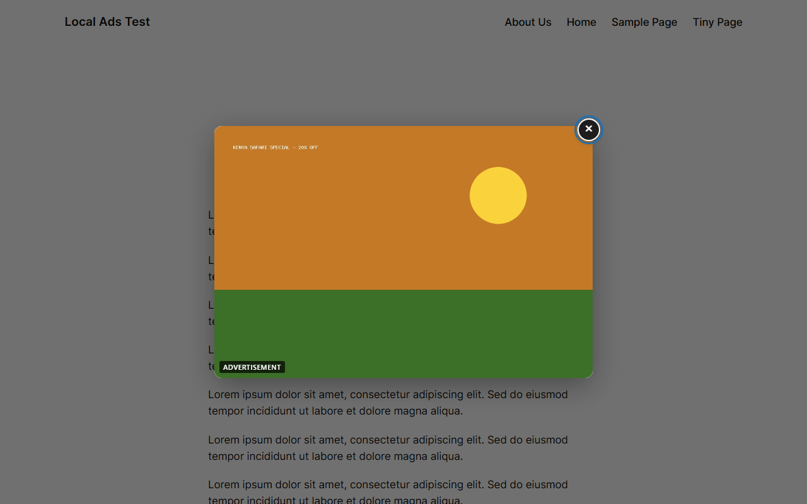
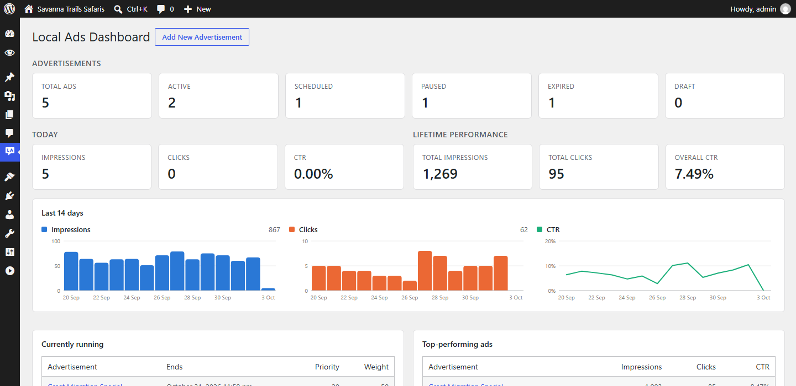
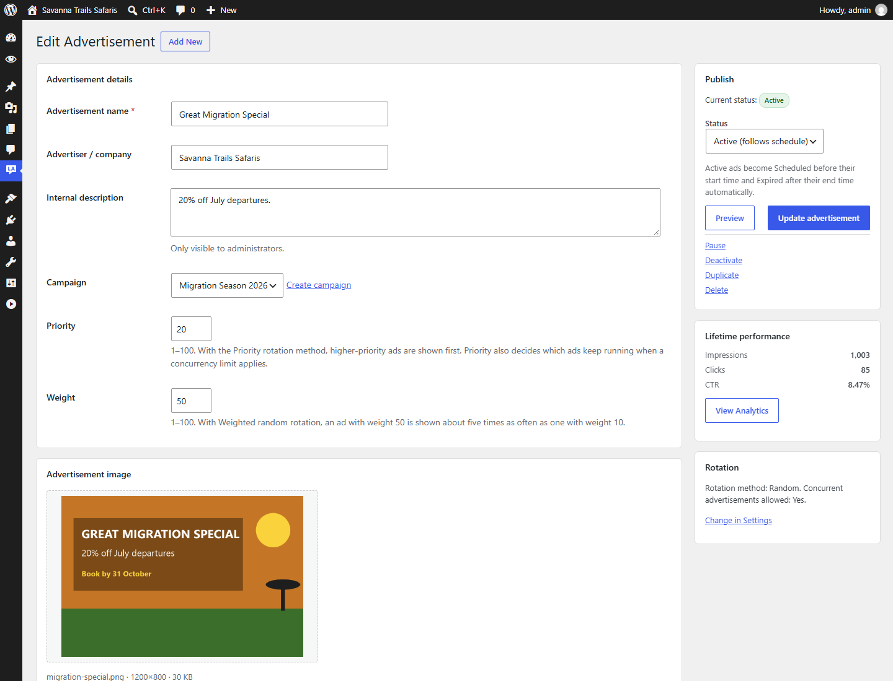
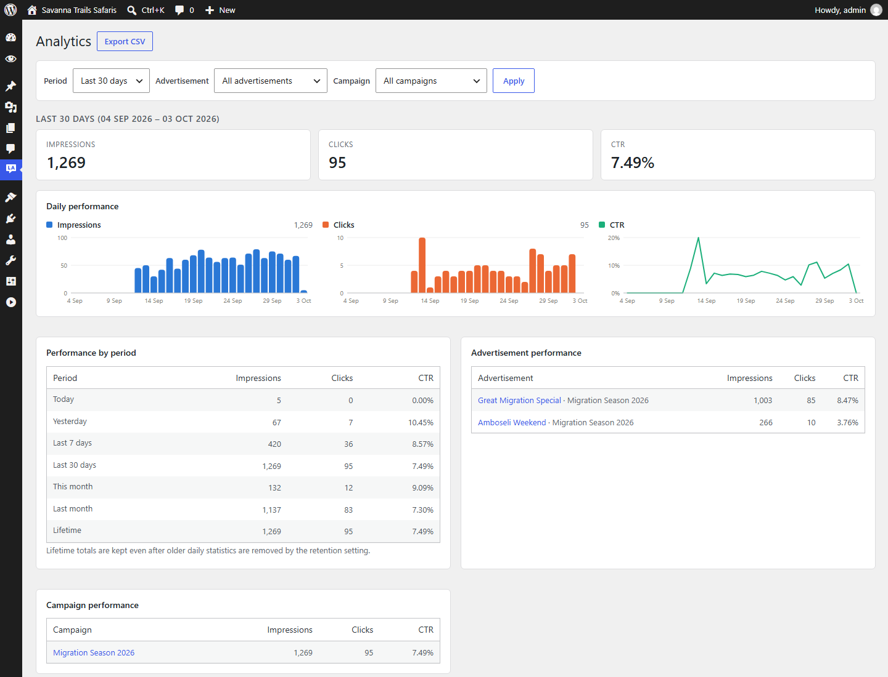
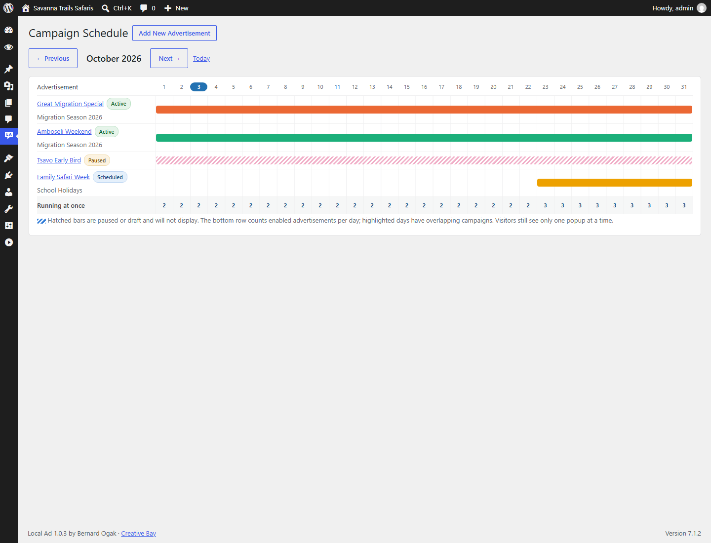

<p align="center">
  
</p>

<h1 align="center">Local Ad</h1>

<p align="center">
  A self-hosted advertisement manager for WordPress: popups, scheduling, rotation and analytics, with no third-party ad network.
</p>

<p align="center">
  <a href="LICENSE"></a>
  
  
  
</p>

<p align="center">
  <a href="https://www.creativebay.co.ke"></a><br>
  Built by <strong>Bernard Ogak</strong> · <a href="https://www.creativebay.co.ke"><strong>Creative Bay</strong></a>
</p>

---

Local Ads lets you sell and run your own advertisements directly from the WordPress dashboard. Images are stored on your server and statistics in your database. No ad, visitor or statistics data is sent anywhere; the only outside request is a check of GitHub for new versions, so updates appear on the WordPress update screens.



## Features

- **Advertisement management**: create, edit, duplicate, activate, pause, deactivate and delete; search, status filters, sorting and bulk actions.
- **Local image storage**: images live in `wp-content/uploads/local-ads/` (configurable), separate from the Media Library, with content-based validation and script execution blocked in the folder.
- **Responsive popup**: overlay, accessible close button, Escape to close, focus trap, optional "Advertisement" label.
- **Triggers**: immediately, after X seconds, when the visitor starts scrolling, after X pixels or after X% of the page.
- **Animations**: fade, slide (up/down/left/right), zoom, bounce and shake entrances, plus a temporary attention shake. Everything is turned off for visitors who prefer reduced motion.
- **Visitor frequency**: once per session, once per visit, once per day, every X hours or always, tracked per advertisement in the browser.
- **Scheduling**: start and end in the site timezone. Ads start and stop on time even when WP-Cron does not run.
- **Concurrent campaigns**: overlapping schedules (or not), a cap on how many run at once, conflict warnings and a monthly calendar. A visitor never sees more than one popup per page view.
- **Rotation**: random, sequential, priority or weighted random.
- **Campaigns**: group ads, pause them together, bound them with dates and report on them together.
- **Analytics**: daily impressions and clicks per ad, CTR, lifetime totals, campaign drill-down, date ranges and CSV export. Counters are atomic, so simultaneous clicks are never lost.
- **Page targeting**: whole site, homepage, posts, pages, WooCommerce products or selected items, with exclusions for checkout, cart, login and URL patterns.
- **Lightweight and cache-friendly**: one small deferred script with no libraries, styles loaded only when a popup opens, nothing loaded when no ad is running, and ads fetched live so cached pages stay correct.
- **Works with Blue Lens Analytics**: every shown or clicked ad is announced as a `localads:track` browser event. [Blue Lens Analytics](https://github.com/Bernard-Ogak/blue_lens_analytics) 0.5+ uses it to link ad clicks to channels, pages and conversions.
- **Secure and private**: capabilities, nonces, prepared SQL and escaping throughout. No IP addresses or personal data are stored.

## Screenshots

| Dashboard | Edit advertisement |
|---|---|
|  |  |

| Analytics | Campaign schedule |
|---|---|
|  |  |

## Requirements

- WordPress 5.8 or later
- PHP 7.4 or later
- MySQL 5.6+ or MariaDB 10.1+

## Installation

**From a release ZIP (recommended)**

1. Download `local-ads.zip` from the [latest release](../../releases/latest).
2. In WordPress go to **Plugins → Add New → Upload Plugin**, choose the ZIP and click **Install Now**.
3. Click **Activate**. **Local Ads** appears in the admin menu.

**From source**

```bash
cd wp-content/plugins
git clone https://github.com/Bernard-Ogak/local-ad.git local-ads
```

The folder must be named `local-ads`.

Then activate **Local Ad** on the Plugins screen.

## Quick start

1. Go to **Local Ads → Add New**.
2. Enter a name, upload an image and add alt text.
3. Add a destination URL (for example `https://example.com/offer/`).
4. Choose a trigger (for example *After 5% page scroll*), a frequency and an animation.
5. Set the start and end dates, or leave them empty to run indefinitely.
6. Click **Preview** to check desktop and mobile, then **Publish advertisement**.

## Documentation

- [User guide](docs/user-guide.md): every screen, setting and workflow.
- [Developer guide](docs/developer-guide.md): architecture, database schema, request flow, security model and building a release.
- [Changelog](CHANGELOG.md)

## Building a release ZIP

```powershell
pwsh ./bin/build-zip.ps1        # Windows PowerShell 5.1 also works
```

This writes `dist/local-ads.zip` with a single `local-ads/` folder and forward-slash paths. Repository-only files (`docs/`, `bin/`, `README.md`, Git files) are left out.

## Contributing

Issues and pull requests are welcome. Please follow the [WordPress coding standards](https://developer.wordpress.org/coding-standards/), keep all strings translatable with the `local-ads` text domain, and describe how you tested your change.

## License

Local Ad is free software, released under the [GNU General Public License v2.0 or later](LICENSE).

Copyright © 2026 Bernard Ogak, [Creative Bay](https://www.creativebay.co.ke).
